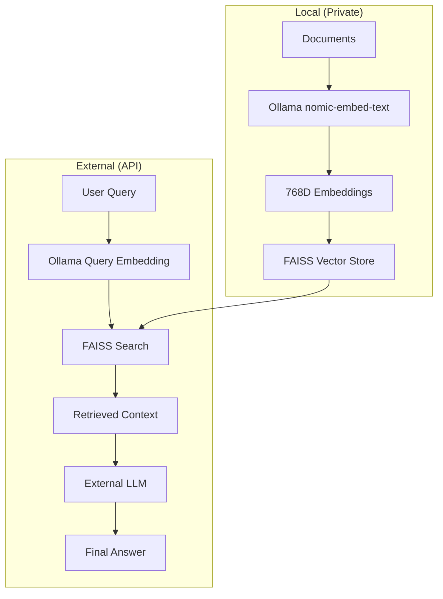

# Hybrid RAG Configuration: Ollama + External LLMs

This guide explains how to use **Ollama for embeddings** while using **external LLM providers** (OpenAI, Google, etc.) for answering questions.

## Architecture Benefits



**Benefits:**
- 🔒 **Privacy**: Documents never leave your machine during embedding
- 💰 **Cost Effective**: Free embeddings, pay only for generation
- 🚀 **Performance**: No API limits on embeddings
- 🎯 **Quality**: Best models for answering (GPT-4, Claude, Gemini)

## Current Configuration

### Embedding Configuration (`api/config/embedder.json`)
```json
{
  "embedder": {
    "client_class": "OllamaClient",
    "model_kwargs": {
      "model": "nomic-embed-text"
    }
  },
  "retriever": {
    "top_k": 20
  },
  "text_splitter": {
    "split_by": "word",
    "chunk_size": 350,
    "chunk_overlap": 100
  }
}
```

### Generation Configuration (`api/config/generator.json`)
Use any provider for generation:
- **OpenAI**: `gpt-4o`, `gpt-4`, `o1`
- **Google**: `gemini-2.5-flash`, `gemini-2.5-pro`
- **OpenRouter**: Access to multiple models
- **Azure**: Enterprise deployments

## Setup Instructions

### 1. Install Ollama Embedding Model
```bash
# Install the embedding model locally
ollama pull nomic-embed-text
```

### 2. Verify Configuration
The system is already configured for this hybrid approach:
- **Embeddings**: Ollama `nomic-embed-text` (768 dimensions)
- **Generation**: Configurable per user request

### 3. Set API Keys
In your `.env` file:
```bash
# Ollama (local - no API key needed)
OLLAMA_HOST=http://localhost:11434

# External LLM providers (choose one or more)
OPENAI_API_KEY=your_openai_key
GOOGLE_API_KEY=your_google_key
OPENROUTER_API_KEY=your_openrouter_key
AZURE_OPENAI_API_KEY=your_azure_key
```

### 4. Usage Examples

#### Frontend Usage
Users can select different providers for generation while embeddings remain local:

```typescript
// User selects generation provider in UI
const config = {
  embedder: "ollama",        // Always Ollama (transparent to user)
  generator: "openai",       // User choice: openai, google, openrouter
  model: "gpt-4o"           // User choice of specific model
}
```

#### API Usage
```python
# Initialize RAG with hybrid approach
rag = RAG(provider="openai", model="gpt-4o")  # Generation provider
# Embeddings automatically use Ollama based on embedder.json

# Prepare retriever (uses Ollama for embeddings)
rag.prepare_retriever("https://github.com/user/repo")

# Ask questions (uses OpenAI for generation)
response = rag.call("How does this code work?")
```

## Technical Implementation

### How It Works
1. **Document Processing**: 
   - Documents are split into chunks
   - Ollama creates embeddings locally (768D vectors)
   - Stored in FAISS index

2. **Query Processing**:
   - User query is embedded with Ollama
   - FAISS searches for similar document chunks
   - Retrieved context + query sent to external LLM
   - External LLM generates the answer

### Code Flow
```python
# In RAG.__init__()
self.is_ollama_embedder = True  # Always true for hybrid setup
self.embedder = get_embedder()  # Returns OllamaClient

# In RAG.call()
retrieved_docs = self.retriever(query)  # Uses Ollama embeddings
answer = self.generator(context + query)  # Uses external LLM
```

## Optimization Recommendations

### 1. Embedding Model Options
- **nomic-embed-text**: High quality, 768D (current)
- **all-minilm**: Smaller, faster, 384D
- **mxbai-embed-large**: Larger, higher quality, 1024D

### 2. Generation Model Selection
- **Cost-Effective**: `gpt-4o-mini`, `gemini-2.5-flash`
- **High Quality**: `gpt-4o`, `gemini-2.5-pro`, `o1`
- **Specialized**: `deepseek-r1` (coding), `claude-3.5-sonnet`

### 3. Performance Tuning
```json
{
  "retriever": {
    "top_k": 20,           // Number of chunks to retrieve
  },
  "text_splitter": {
    "chunk_size": 350,     // Smaller chunks = more precise
    "chunk_overlap": 100   // Overlap prevents information loss
  }
}
```

## Monitoring & Costs

### Cost Breakdown
- **Embeddings**: $0 (local Ollama)
- **Generation**: Per external provider rates
- **Storage**: Local FAISS indices

### Performance Metrics
- **Embedding Speed**: ~100 docs/second (local)
- **Query Latency**: 1-3 seconds (depending on external LLM)
- **Memory Usage**: ~2GB for Ollama + indices

## Troubleshooting

### Common Issues
1. **Ollama Model Missing**: Run `ollama pull nomic-embed-text`
2. **Dimension Mismatch**: Use `python clear_embeddings.py` after model changes
3. **API Limits**: Switch generation provider in real-time

### Health Check
```bash
python test_rag_fix.py
```

This hybrid approach gives you the best of both worlds: private, fast, free embeddings with access to the most capable LLMs for generation!