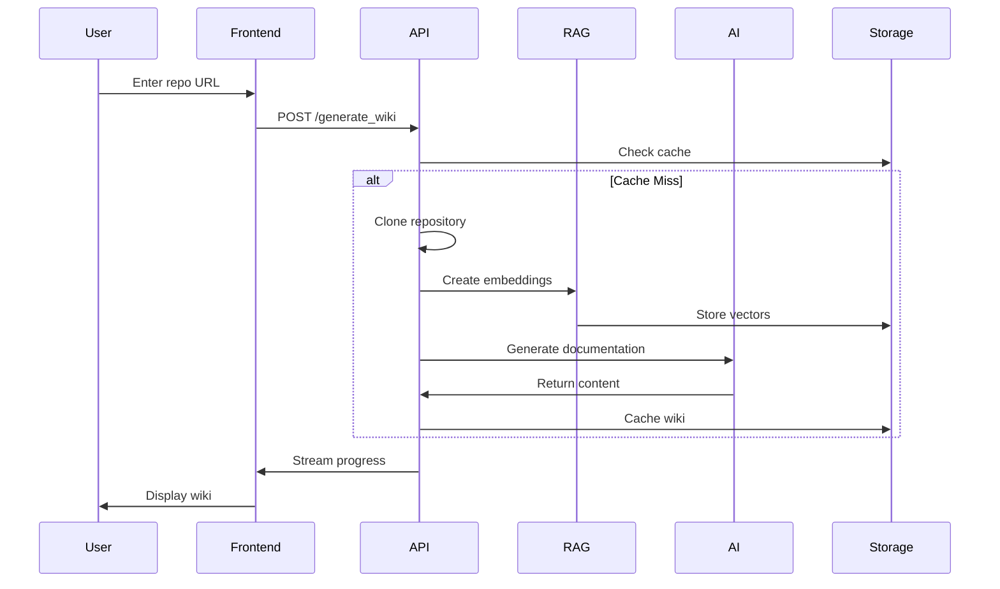
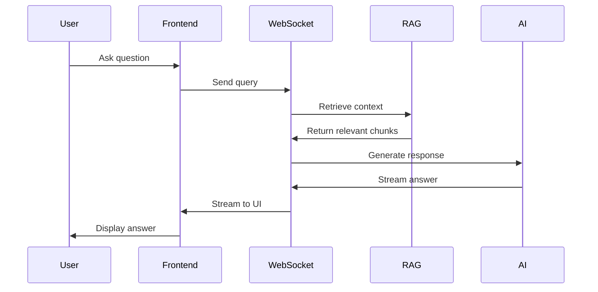
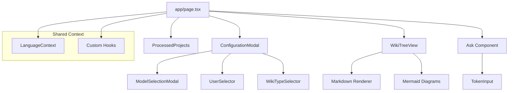
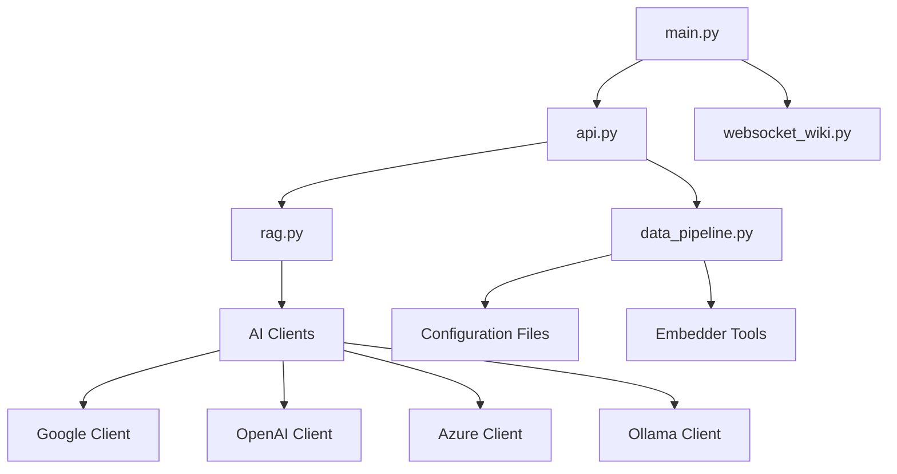

# System Patterns: OpenProductWiki

## Architecture Overview
OpenProductWiki follows a **full-stack architecture** with clear separation between frontend and backend services:

```mermaid
graph TB
    subgraph "Frontend (Next.js)"
        UI[User Interface]
        Comp[React Components]
        State[State Management]
        I18n[Internationalization]
    end
    
    subgraph "Backend (FastAPI)"
        API[REST API]
        WS[WebSocket API]
        RAG[RAG Engine]
        Pipeline[Data Pipeline]
    end
    
    subgraph "AI Providers"
        Google[Google Gemini]
        OpenAI[OpenAI]
        OpenRouter[OpenRouter]
        Azure[Azure OpenAI]
        Ollama[Local Ollama]
    end
    
    subgraph "Data Storage"
        Repos[Repository Cache]
        Embeddings[Vector Database]
        WikiCache[Generated Wiki Cache]
    end
    
    UI --> API
    UI --> WS
    API --> RAG
    API --> Pipeline
    RAG --> AI Providers
    Pipeline --> Data Storage
```

## Key Architectural Decisions

### 1. Provider-Agnostic AI System
**Pattern**: Abstract AI provider interface with concrete implementations
**Why**: Enables flexibility in model selection and reduces vendor lock-in
**Implementation**: 
- Base client interface in `api/` directory
- Provider-specific clients (OpenAI, Google, Azure, etc.)
- Runtime provider selection based on configuration

### 2. Configuration-Driven Behavior
**Pattern**: JSON configuration files for system behavior
**Why**: Allows runtime customization without code changes
**Files**:
- `generator.json`: AI model configurations
- `embedder.json`: Embedding and RAG settings
- `repo.json`: Repository processing rules

### 3. Streaming Response Architecture
**Pattern**: WebSocket-based real-time communication
**Why**: Provides better user experience for long-running operations
**Implementation**:
- WebSocket endpoint for wiki generation progress
- Streaming chat completions for Q&A feature
- Real-time status updates during processing

### 4. Component-Based Frontend
**Pattern**: React components with clear separation of concerns
**Key Components**:
- `WikiTreeView`: Navigation and content display
- `Ask`: Q&A chat interface
- `ConfigurationModal`: Settings management
- `Mermaid`: Diagram rendering
- `ProcessedProjects`: Project history

## Data Flow Patterns

### Repository Processing Pipeline


### Q&A Interaction Pattern


## Design Patterns in Use

### 1. Factory Pattern
- **Location**: AI client creation
- **Purpose**: Runtime provider selection based on configuration
- **Benefit**: Easy addition of new AI providers

### 2. Strategy Pattern
- **Location**: Model provider implementations
- **Purpose**: Interchangeable AI provider behavior
- **Benefit**: Consistent interface across different AI services

### 3. Observer Pattern
- **Location**: WebSocket event handling
- **Purpose**: Real-time UI updates during processing
- **Benefit**: Responsive user experience

### 4. Repository Pattern
- **Location**: Data access layers
- **Purpose**: Abstract data storage operations
- **Benefit**: Testable and maintainable data access

## Component Relationships

### Frontend Architecture


### Backend Architecture


## Error Handling Patterns

### 1. Graceful Degradation
- Fallback to simpler models if primary fails
- Partial wiki generation if some sections fail
- Diagram error recovery and regeneration

### 2. User-Friendly Error Messages
- Clear error descriptions for common failures
- Actionable suggestions for resolution
- Progress preservation during partial failures

### 3. Retry Mechanisms
- Automatic retry for transient API failures
- Exponential backoff for rate-limited services
- Circuit breaker pattern for unreliable services

This architecture prioritizes **flexibility**, **performance**, and **user experience** while maintaining **security** and **scalability** for various deployment scenarios.